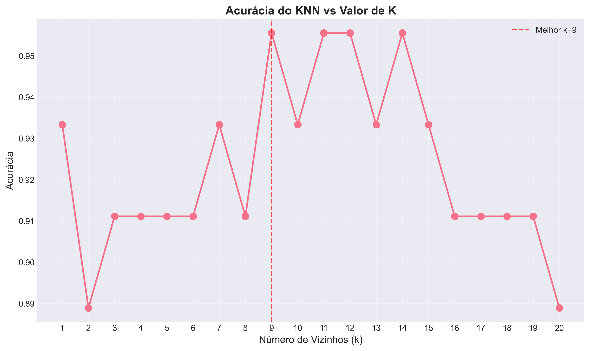
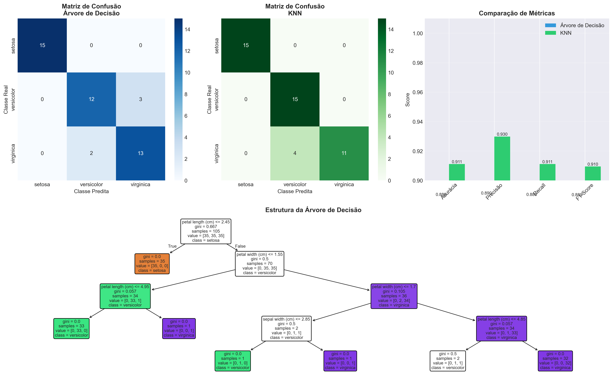

# 🏷️ Atividade Prática: Classificação Supervisionada


Projeto de aprendizado supervisionado aplicando **Árvore de Decisão** e **K-Nearest Neighbors (KNN)** no dataset **Iris**.  

---

## 📊 Gráficos

### Acurácia por valor de K (KNN)



### Comparativo final: Árvore de Decisão vs KNN



---

## ⚡ Execução Rápida

1. Clone o repositório:

```bash
git clone <URL_DO_REPOSITORIO>
cd <PASTA_DO_REPOSITORIO>
```

2. Crie e ative um ambiente virtual (opcional):

```bash
python -m venv venv
# Windows
venv\Scripts\activate
# Linux/Mac
source venv/bin/activate
```

3. Instale as dependências:

```bash
pip install numpy scikit-learn matplotlib
```

4. Execute o script principal para gerar gráficos:

```bash
python decisioncomvisu.py
```

Algoritmos Utilizados:

1. Árvore de Decisão
Interpretável, rápido, não requer normalização, captura relações não-lineares.
Pode overfitar se muito profunda, sensível a pequenas variações.

2. K-Nearest Neighbors (KNN)
Simples, intuitivo, não assume distribuição dos dados.
Custoso em datasets grandes, sensível à escala, performance depende de k.

Métricas Avaliadas:

Acurácia: proporção de predições corretas
Precisão: VP / (VP + FP)
Recall: VP / (VP + FN)
F1-Score: média harmônica entre precisão e recall
(VP = Verdadeiros Positivos, FP = Falsos Positivos, FN = Falsos Negativos)

Conclusões:

Alta acurácia (>95%) para ambos os modelos.
Árvore de Decisão: ideal para interpretabilidade.
KNN: eficiente para datasets pequenos e simples.

Próximos passos:

    - Testar outros datasets

    - Aplicar validação cruzada

    - Ajustar hiperparâmetros com GridSearchCV

    - Experimentar ensemble methods

    - Analisar feature importance

🔗 Referências:

Scikit-learn: ("https://scikit-learn.org/stable")

UCI Machine Learning Repository: ("https://archive.ics.uci.edu")

Fisher, R.A. (1936). Iris dataset
